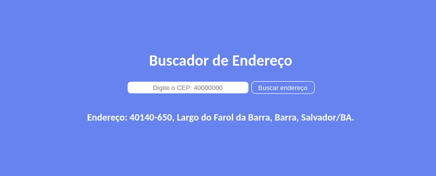
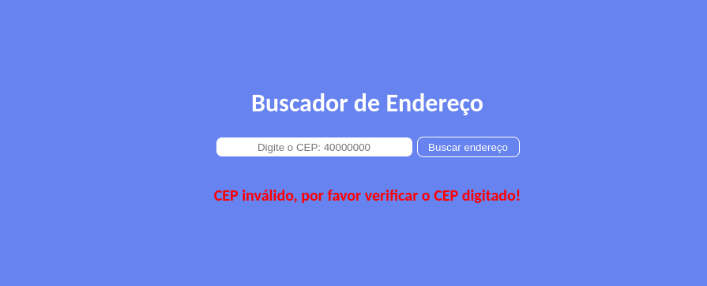
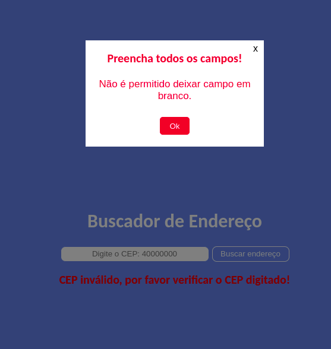

<h1 align="center"> Buscador de Endereço</h1>

Desenvolvido para colocar em prática os meus conhecimentos de tecnologias WEB.  

  <a href="#-tecnologias">Tecnologias</a>&nbsp;&nbsp;&nbsp;|&nbsp;&nbsp;&nbsp;
  <a href="#-projeto">Projeto</a>&nbsp;&nbsp;&nbsp;|&nbsp;&nbsp;&nbsp;
  <a href="#memo-licença">Licença</a>

  

 

  
Busca retornada com sucesso:

  
   
  
  
CEP digitado inválido:

  
   
  
  
Popup de alerta de campo vazio:

  

## 🚀 Tecnologias

Esse projeto foi desenvolvido com as seguintes tecnologias:

- HTML e CSS
- JavaScript
- Git e Github
- Api ViaCep

## 💻 Projeto

Buscador de endereço com validação se o cep digitado existe ou se está no formato permitido.

- [Acesse o projeto finalizado, online](https://henriquemvss.github.io/buscadorCep/)

## :memo: Licença

Esse projeto está sob a licença MIT.

---
